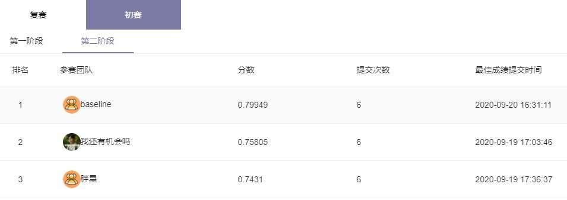

# 科大讯飞X光安检图像识别 Top1

队伍名：baseline 

### 比赛地址：[X光安检图像识别](http://challenge.xfyun.cn/topic/info?type=Xray)

## 整体方案
- Cascade RCNN
- 数据增强
- resnetxt101_64x4d + res2net101 集成
- SSL半监督学习

## 创新性
（以下策略 mAP: 0.685->0.799)
+ MixPatch
    - 结合Mixup和Cutmix，提出的MixPatch方案，扩增的样本比直接填鸭更自然，该策略提高了目标的召回率，同时也减轻了目标样本不均衡的问题。

+ Semi-Supervised Learning (SSL)
    - 2次伪标签，伪标签阈值0.9，检测出的目标结合MixPatch使用，最终两者结合提高的点是最多的

+ Weighted Boxes Fusion (WBF)
    - resnetxt101_64x4d + res2net101 集成

## 环境
- Ubuntu18.04
- mmdetection2.3.0
- GPU: 2080Ti*4